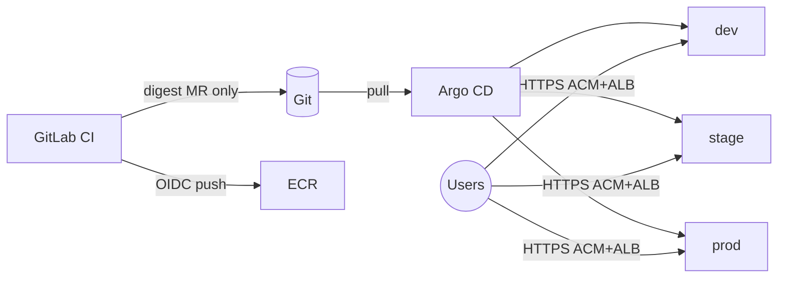

# boutique-eks-gitops

**Production-pilot GitOps platform for Online Boutique on Amazon EKS — Git is the only deploy authority.**

[](https://www.terraform.io/)
[](https://aws.amazon.com/eks/)
[](https://docs.gitlab.com/ee/ci/)
[](https://argo-cd.readthedocs.io/)
[](docs/ARCHITECTURE.md)

> Version badges above reflect the locked pin matrix in [`docs/versions.md`](docs/versions.md). CI status badges are omitted (use GitLab pipelines).



Full design: [`docs/ARCHITECTURE.md`](docs/ARCHITECTURE.md) · Deep dive: [`docs/architecture/`](docs/architecture/)

---

## 1. Project Overview

This repository is the **operational control plane** for running a scoped Online Boutique workload on a single AWS EKS cluster in `eu-central-1`. Engineers change what runs in the cluster by merging Git changes — primarily **image digest** updates. GitLab CI builds, scans, and signs images, then opens digest-only merge requests. It never `kubectl apply`s or `argocd sync`s to the cluster.

**Audience:** platform engineers, SRE/GitOps practitioners, and operators reviewing a production-oriented AWS reference.

**Maturity:** production **pilot** — multi-AZ nodes, digest promotion, security baseline, and on-cluster observability; **not** multi-account or multi-region HA. **M3 PASS** (2026-07-19). Teardown is **mandatory** next (Phase 11 / Topic 14).

**Outcomes**

- Digest-only releases with reviewable promotion `dev → stage → prod`
- Argo CD app-of-apps + ApplicationSet; **manual sync for prod**
- Kyverno, External Secrets, NetworkPolicy baseline
- Prometheus, Loki, Grafana, Alertmanager → **email**
- Frontend canary on stage **and** prod (Argo Rollouts)

---

## 2. Architecture

| Layer | Responsibility |
|-------|----------------|
| **Infrastructure** | Terraform: VPC (1× NAT), EKS 1.31, ECR, IAM OIDC/IRSA, ACM/Route53 data, remote state |
| **Platform** | LB Controller, external-dns, cert-manager, Argo CD, Kyverno, ESO, NetworkPolicy, Rollouts, monitoring |
| **Applications** | 7 Boutique services + Redis via Helm; env overlays pin digests |
| **CI/CD** | GitLab CI: test → build → Trivy → cosign (Sigstore keyless) → digest MR |
| **Observability** | Prometheus + Loki + Grafana + Alertmanager (email); no CloudWatch/PagerDuty/OTel in v1 |

**Environments:** `dev`, `stage`, `prod` as namespaces on **one** cluster (cost over blast-radius isolation — see architecture).

Details: [`docs/ARCHITECTURE.md`](docs/ARCHITECTURE.md) · [`docs/architecture/`](docs/architecture/)

---

## 3. Features

| Domain | Capability | Status |
|--------|------------|--------|
| **Infrastructure** | Terraform VPC / EKS / ECR / OIDC / remote state | ✅ Implemented |
| **Platform** | Ingress (ACM+ALB), external-dns, cert-manager | ✅ Implemented |
| **GitOps** | Argo CD app-of-apps + ApplicationSet; prod manual sync | ✅ Implemented |
| **Security** | Kyverno digest/ECR rules, ESO, NetworkPolicy | ✅ Implemented |
| **Observability** | Prom / Loki / Grafana / AM email | ✅ Implemented |
| **Applications** | 7 Boutique Helm charts + Redis; boutique hostnames | ✅ Implemented |
| **CI/CD** | Digest-only MRs; Sigstore keyless cosign; Trivy CRITICAL gate | ✅ Implemented |
| **Delivery** | Promotion governance; frontend canary stage+prod | ✅ Implemented |
| **Ops** | [PRODUCTION_CHECKLIST](docs/PRODUCTION_CHECKLIST.md) M3 PASS; teardown **mandatory next** | Topic 14 ⬜ |


Legend: ✅ Implemented · 🚧 Planned · ⬜ Not started · ❌ Out of scope (mesh, CloudWatch, PagerDuty, OTel, multi-region)

---

## 4. Technology Stack

| Layer | Technology | Version / note |
|-------|------------|----------------|
| Cloud | AWS `eu-central-1` | — |
| IaC | Terraform | ≥ 1.9 |
| Orchestration | Amazon EKS | **1.31** |
| Nodes | EC2 `m6i.large` ×3 (ASG 2–5) | On-Demand |
| Packaging | Helm | 3.16.x |
| GitOps | Argo CD | v2.14.x (pin at bootstrap) |
| Progressive delivery | Argo Rollouts | v1.8.x (pin) |
| Policy | Kyverno | 1.16.x |
| Secrets | External Secrets Operator | chart pin at Phase 5 |
| Ingress / DNS / TLS | AWS LB Controller, external-dns, ACM (+ cert-manager installed) | See ADRs |
| Registry | Amazon ECR | scan-on-push |
| CI | GitLab CI | OIDC → IAM |
| Scan / sign | Trivy **0.71.0**, cosign **2.4.x** (Sigstore keyless) | — |
| Observability | kube-prometheus-stack, Loki, Grafana, Alertmanager | email alerts |

Non-obvious choices: [`docs/architecture/README.md`](docs/architecture/README.md) · pins: [`docs/versions.md`](docs/versions.md)

---

## 5. Repository Structure

```text
boutique-eks-gitops/
├── terraform/           # AWS foundation (modules + envs/prod)
├── gitops/
│   ├── bootstrap/       # Argo CD + root app
│   ├── apps/            # app-of-apps / ApplicationSets
│   ├── platform/        # ingress, policy, monitoring, rollouts
│   └── envs/{dev,stage,prod}/  # digest pins + env values
├── charts/              # Boutique Helm charts (7 services)
├── docs/                # architecture, plan, setup, operations, runbooks
├── examples/            # smoke samples (not prod config)
├── tests/               # helm / policy / smoke checks
└── .gitlab-ci.yml       # digest pipeline
```

Full structure blueprint: [`docs/implementation/plan.md`](docs/implementation/plan.md) §7.13. Setup topics: [`docs/setup/`](docs/setup/).

---

## 6. Prerequisites

- [ ] AWS account with permission to create VPC, EKS, IAM, ECR, ACM (admin or equivalent scoped roles)
- [ ] Route53 zone for `biroltilki.art`
- [ ] GitLab project with CI and OIDC federation capability
- [ ] CLIs per pin matrix: `terraform` ≥ 1.9, `kubectl` 1.31.x, `helm` 3.16.x, AWS CLI
- [ ] SMTP mailbox for Alertmanager email tests
- [ ] Budget awareness: ~**$35–45** for a 2-day run with teardown; ~**$350–500/mo** if left up — see [`docs/architecture/10-cost-model.md`](docs/architecture/10-cost-model.md)

Authoritative checklist: [`docs/setup/01-prerequisites.md`](docs/setup/01-prerequisites.md)

---

## 7. Quick Start

```bash
git clone <your-gitlab-repo-url> boutique-eks-gitops
cd boutique-eks-gitops
# Read the plan and architecture before any apply:
#   docs/ARCHITECTURE.md
#   docs/implementation/plan.md
#   ROADMAP.md
```

**Do not provision AWS from the README.** Follow the Setup Guide: [`docs/setup/`](docs/setup/).

---

## 8. Installation

Bootstrap is **phase-ordered** and documented only under `docs/setup/`:

| Phase (summary) | Setup topics |
|-----------------|--------------|
| Foundation / versions | `01`, `02` |
| Terraform state + EKS | `03`, `04` |
| Ingress / DNS / TLS | `05` |
| Argo CD | `06` |
| Security baseline | `07` |
| Observability | `08` |
| Boutique charts + ECR bootstrap digests | `09` |
| GitLab CI digest pipeline | `10` |
| Promotion + canary | `11`, `12` |
| Production checklist | `13` |
| **Immediate teardown after tests** | `14` |

Index: [`docs/setup/README.md`](docs/setup/README.md)

---

## 9. Configuration

| Area | Where | Notes |
|------|-------|-------|
| AWS / cluster | `terraform/envs/prod/` | `terraform.tfvars.example` — no secrets committed |
| Platform | `gitops/platform/*` | Helm values / manifests for shared services |
| App env values + digests | `gitops/envs/{dev,stage,prod}/` | Promotion = copy digests; prod path CODEOWNERS `@btilki` |
| Charts | `charts/<service>/values.yaml` | `image.repository` + `image.digest` |
| Secrets | AWS Secrets Manager / SSM → ESO | **Never** store secrets in Git |
| Versions | `docs/versions.md` | Pins for CI images and cluster add-ons |

---

## 10. Deployment

```text
build/scan/sign → ECR → digest MR → merge → Argo sync
dev (auto) → stage (auto/controlled + canary) → prod (CODEOWNERS + manual sync + canary)
```

Rollback: `git revert` of the digest MR (Argo reconciles).  
Promotion / rollback docs: [`docs/promotion.md`](docs/promotion.md), [`docs/rollback.md`](docs/rollback.md).
Plan: [`docs/implementation/plan.md`](docs/implementation/plan.md) · Flow: [`docs/architecture/05-deployment-flow.md`](docs/architecture/05-deployment-flow.md)

---

## 11. CI/CD

| Pipeline concern | Trigger | Behavior |
|------------------|---------|----------|
| test → build | MR / main (as configured) | Build service images |
| scan | after build | Trivy **0.71.0**; fail on CRITICAL |
| sign | after scan pass | cosign **Sigstore keyless** (GitLab OIDC) |
| gitops | after sign | Open MR patching **only** `image.digest` under `gitops/envs/dev/` |

**Hard rule:** no `kubectl` / `argocd sync` in CI for routine deploys.

Entry: [`.gitlab-ci.yml`](.gitlab-ci.yml) · Contract: [`docs/ci.md`](docs/ci.md)

---

## 12. GitOps

| Item | Choice |
|------|--------|
| Tool | Argo CD |
| Pattern | App-of-apps + ApplicationSet |
| Paths | `gitops/bootstrap/`, `gitops/apps/`, `gitops/platform/`, `gitops/envs/` |
| Prod | `syncPolicy.automated` **absent** — manual sync only |
| Host | `argocd.boutique.biroltilki.art` |

See [`gitops/README.md`](gitops/README.md) · [`docs/architecture/05-deployment-flow.md`](docs/architecture/05-deployment-flow.md)

---

## 13. Monitoring

| Signal | Stack |
|--------|-------|
| Metrics | Prometheus (kube-prometheus-stack) |
| Logs | Grafana Loki |
| UI | Grafana @ `grafana.boutique.biroltilki.art` |
| Alerts | Alertmanager → **email** (one critical ingress/shop-down rule first) |

Not in v1: CloudWatch, PagerDuty, OpenTelemetry/traces.

Details: [`docs/architecture/09-observability.md`](docs/architecture/09-observability.md) · Runbook: [`docs/runbooks/alerting.md`](docs/runbooks/alerting.md) *(Phase 6)*

---

## 14. Security

| Practice | Implementation |
|----------|----------------|
| Least privilege | IRSA for controllers; GitLab OIDC role scoped to ECR (no cluster deploy) |
| Secrets | ESO ← Secrets Manager/SSM; nothing secret in Git |
| Supply chain | Trivy gate + Sigstore keyless cosign + ECR scan-on-push |
| Admission | Kyverno: digest-only, deny `:latest`, ECR allowlist |
| Network | Default-deny NetworkPolicy patterns per app namespace |
| Prod governance | CODEOWNERS `@btilki` on `gitops/envs/prod/**` |

Honest limit: namespace isolation on one cluster is **not** multi-account isolation — [`docs/architecture/07-security-architecture.md`](docs/architecture/07-security-architecture.md).

Policy doc: [`SECURITY.md`](SECURITY.md) · Architecture: security section above.

---

## 15. Testing

| Type | Where / how |
|------|-------------|
| Terraform fmt | `make lint` → `terraform fmt -check -recursive terraform` |
| Docs presence | `make docs-check` |
| Helm lint | GitLab CI `helm_lint` job · locally: `helm lint charts/*` |
| Policy fixtures | `tests/policy/` (sample deny fixtures; Kyverno live policies under `gitops/platform/kyverno/`) |
| Smoke / e2e | Setup Guide **Validation** sections + [`docs/PRODUCTION_CHECKLIST.md`](docs/PRODUCTION_CHECKLIST.md) |
| CI gates | Trivy CRITICAL + cosign keyless + digest MR path guards |

Local entry: `make lint` && `make docs-check` (no install/apply bypass).  
[`tests/README.md`](tests/README.md)

---

## 16. Documentation

| Document | Description |
|----------|-------------|
| [Architecture](docs/ARCHITECTURE.md) | System design summary |
| [Architecture deep dive](docs/architecture/) | Requirements → cost model |
| [Implementation plan](docs/implementation/plan.md) | Phases, inventories, validation |
| [Roadmap](ROADMAP.md) | Phase status and milestones |
| [Setup Guide](docs/setup/) | **Authoritative** bootstrap |
| [ADRs](docs/adr/) | Design decisions |
| [Versions](docs/versions.md) | Pin matrix |
| [Promotion](docs/promotion.md) / [Rollback](docs/rollback.md) | Digest governance |
| [PRODUCTION_CHECKLIST](docs/PRODUCTION_CHECKLIST.md) | Readiness (M3) |
| [Operations index](docs/operations/README.md) | Day-2 deploy, DR, incidents, health |
| [Teardown runbook](docs/runbooks/teardown.md) | Immediate destroy after tests (Topic 14 / M4) |
| [Runbooks index](docs/runbooks/README.md) | Symptom playbooks: ingress, Argo, Kyverno, canary, alerting |
| [Cost model](docs/architecture/10-cost-model.md) | 2-day vs monthly estimates |

---

## 17. Roadmap

| Phase | Title | Status |
|-------|--------|--------|
| 1 | Foundation | ✅ |
| 2 | AWS foundation (Terraform) | ✅ |
| 3 | Ingress, DNS, TLS | ✅ |
| 4 | Argo CD bootstrap | ✅ |
| 5 | Security baseline | ✅ |
| 6 | Observability | ✅ |
| 7 | Boutique charts + ECR digest bootstrap | ✅ |
| 8 | GitLab CI digest pipeline | ✅ |
| 9 | Promotion + frontend canary | ✅ |
| 10 | Production readiness (M3) | ✅ |
| 11 | Teardown (immediate after tests) | ⬜ |

Milestones: **M1–M3** complete · **M4** = Topic 14 teardown — details in [`ROADMAP.md`](ROADMAP.md).

---

## 18. Contributing

1. One phase / Setup topic at a time; do not skip the Setup Guide order.  
2. Prefer small MRs; digest promotion MRs must touch only digest fields.  
3. Prod path changes require `@btilki` (CODEOWNERS).  
4. Never commit secrets or long-lived AWS keys.

Full guide: [`CONTRIBUTING.md`](CONTRIBUTING.md).

---

## 19. License

Licensed under the **Apache License, Version 2.0**. See [`LICENSE`](LICENSE).

```text
Copyright 2026 Birol Tilki
```

Upstream Online Boutique is a separate Google project; this repository’s control-plane configs and docs are covered by the license above.

---

## 20. References

- [Argo CD documentation](https://argo-cd.readthedocs.io/)
- [Argo Rollouts](https://argo-rollouts.readthedocs.io/)
- [Kyverno](https://kyverno.io/)
- [External Secrets Operator](https://external-secrets.io/)
- [Sigstore / cosign](https://docs.sigstore.dev/)
- [Trivy](https://trivy.dev/)
- [AWS Load Balancer Controller](https://kubernetes-sigs.github.io/aws-load-balancer-controller/)
- [Google Online Boutique](https://github.com/GoogleCloudPlatform/microservices-demo) (upstream app inspiration)
- Project architecture: [`docs/ARCHITECTURE.md`](docs/ARCHITECTURE.md)

---

## DNS (locked)

```text
argocd.boutique.biroltilki.art
grafana.boutique.biroltilki.art
dev-boutique.biroltilki.art
stage-boutique.biroltilki.art
boutique.biroltilki.art
```
