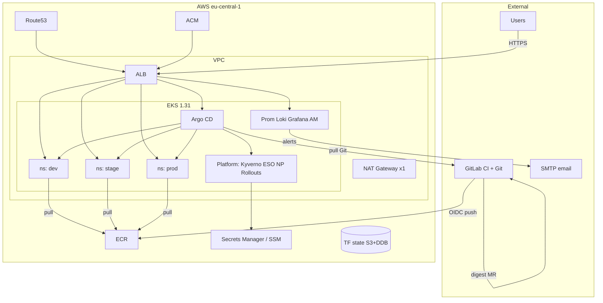

# Architecture — boutique-eks-gitops

**Status:** Accepted — M3 + M4 PASS (2026-07-19/20); pilot closed — **AWS cloud deleted** (EKS/VPC/NAT/ALB/ECR, TF backend, SM, ACM, Route53)  
**Maturity:** Production pilot (single AWS account, single EKS cluster) — **decommissioned**  
**Region:** `eu-central-1` (when provisioned)  
**Deep docs:** [docs/architecture/](architecture/README.md)  
**Plan:** [implementation/plan.md](implementation/plan.md) · **Roadmap:** [../ROADMAP.md](../ROADMAP.md) · **Ops:** [operations/README.md](operations/README.md)

---

## Executive summary

This repository is the **operational control plane** for Online Boutique on Amazon **EKS (Elastic Kubernetes Service)**. **Git is the only authority** for what runs on the cluster. GitLab **CI (Continuous Integration)** builds, scans (Trivy), signs (cosign), and opens **MRs (Merge Requests)** that change **only image digests**. Argo CD reconciles desired state; it never receives deploy commands from CI.

Three application environments (`dev`, `stage`, `prod`) share one cluster as namespaces, isolated by NetworkPolicy, sync policy, CODEOWNERS, and manual prod sync. Public HTTPS uses **ACM (AWS Certificate Manager)** on **ALB (Application Load Balancer)**. Observability is entirely on-cluster (**Prometheus, Loki, Grafana, Alertmanager → email**). Short pilots end with **Phase 11 ordered teardown immediately after all tests** (no keep-alive). **This pilot’s AWS resources were destroyed 2026-07-19/20** (Appendix T); the live cluster is gone.

---

## 1. Requirements (condensed)

| ID | Requirement | Implication |
|----|-------------|-------------|
| FR-01 | Terraform foundation | Modular VPC/EKS/ECR/IAM/OIDC + remote state |
| FR-02 | Ingress/DNS/TLS | LB Controller + external-dns + ACM; cert-manager present |
| FR-03 | Argo GitOps | App-of-apps + ApplicationSet; prod manual sync |
| FR-04 | Security baseline | Kyverno digest/ECR; ESO; NetworkPolicy |
| FR-05 | Observability | Prom/Loki/Grafana/AM email — no CW/PD/OTel |
| FR-06–09 | Boutique + CI + promote + canary | 7 services; digest MRs; stage+prod canary |
| FR-10–11 | Readiness + teardown | Checklist; ordered destroy |

Full tables: [01-requirements.md](architecture/01-requirements.md)

---

## 2–3. Constraints & assumptions (condensed)

**Constraints:** AWS-only; one cluster; cost-sensitive; no static AWS keys; digest-only; CI never deploys; `@btilki` on prod paths.

**Assumptions:** Admin AWS + Route53 `biroltilki.art`; GitLab OIDC; ~low test traffic; SMTP available for Alertmanager.

Details: [01-requirements.md](architecture/01-requirements.md) (constraints/assumptions sections)

---

## 4. High-level architecture



**Alt text:** Users reach ALB over HTTPS; GitLab pushes signed images to ECR and digest MRs to Git; Argo CD pulls Git and syncs platform and env namespaces; Alertmanager emails via SMTP; Terraform state lives in S3.

| Layer | Components | Responsibility |
|-------|------------|----------------|
| Infrastructure | VPC, NAT×1, EKS, ECR, IAM/OIDC/IRSA, ACM, Route53, S3/DDB state | Cloud foundation |
| Platform | LB Controller, external-dns, cert-manager, Argo CD, Kyverno, ESO, NP, Rollouts | Shared cluster services |
| Applications | 7 Boutique services + Redis | Storefront workloads per env |
| Observability | Prometheus, Loki, Grafana, Alertmanager | Metrics, logs, email alerts |
| CI/CD | GitLab CI, Trivy, cosign, digest MRs | Build → scan → sign → Git only |

**Environments:** Same cluster; differ by namespace, Git path `gitops/envs/*`, hostname, sync policy (prod manual), replica/canary settings, CODEOWNERS.

Deep dive: [02-system-context.md](architecture/02-system-context.md), [03-component-design.md](architecture/03-component-design.md)

---

## 5–9. Flows & boundaries (pointers)

| Topic | Doc |
|-------|-----|
| Component inventory | [03-component-design.md](architecture/03-component-design.md) |
| Data / secrets / TF flows | [04-data-flows.md](architecture/04-data-flows.md) |
| Deploy / promote / rollback | [05-deployment-flow.md](architecture/05-deployment-flow.md) |
| VPC / ingress / DNS / NP | [06-network-design.md](architecture/06-network-design.md) |
| Trust zones / IRSA / supply chain | [07-security-architecture.md](architecture/07-security-architecture.md) |

---

## 10–12. Failure, scale, DR (condensed)

- **HA:** Multi-AZ node group; single NAT (cost tradeoff — AZ NAT loss impacts egress).
- **Scale:** Cluster ASG 2–5× `m6i.large`; HPA optional later; Prom/Loki retention capped.
- **DR (pilot):** Rebuild from Git + Terraform; RTO hours not minutes; no multi-region.
- **Teardown:** Phase 11 ordered destroy — [10-cost-model.md](architecture/10-cost-model.md)

Full: [08-resilience-and-dr.md](architecture/08-resilience-and-dr.md)

---

## 13–14. Observability & cost (condensed)

- Metrics/logs/alerts on-cluster; **no** distributed tracing in v1.
- Critical alert: shop/ingress down → **email**.
- ~$350–500/mo if left up; ~$30–45 for 2-day pilot with teardown.

Full: [09-observability.md](architecture/09-observability.md), [10-cost-model.md](architecture/10-cost-model.md)

---

## 15. Key tradeoffs

| Decision | Chosen | Rejected | Why | Cost of choice |
|----------|--------|----------|-----|----------------|
| Deploy authority | GitOps pull (Argo) | CI `kubectl` push | Audit + drift control | Argo ops skill |
| Env isolation | Namespaces | 3 clusters | Cost | Shared blast radius |
| TLS | ACM + ALB | cert-manager DNS-01 primary | Fewer moving parts | ACM dependency |
| Observability | Prom/Loki/AM | CloudWatch/PagerDuty/OTel | Cost + simplicity | Self-operate stack |
| Images | Digest-only | Tags/`latest` | Immutability | CI must patch digests |

Proposed ADRs: see [architecture/README.md](architecture/README.md#adr-recommendations)

---

## 16. Future enhancements

| Enhancement | Prerequisite | Effort | Roadmap |
|-------------|--------------|--------|---------|
| Second EKS (prod split) | Stable ApplicationSet | L | Deferred |
| Remaining Boutique services | Charts + digests | M | Deferred |
| OTel / Tempo | Obs stable | M | Deferred |
| Service mesh | Explicit need | XL | Out |
| Multi-region DR | Multi-cluster | XL | Out |

---

## DNS (locked)

```text
argocd.boutique.biroltilki.art
grafana.boutique.biroltilki.art
dev-boutique.biroltilki.art
stage-boutique.biroltilki.art
boutique.biroltilki.art
```

---

## Mapping (component → repo → setup)

| Component | Repo path | Setup topic |
|-----------|-----------|-------------|
| Versions / ADRs | `docs/versions.md`, `docs/adr/` | 01, 02 |
| Remote state | `terraform/envs/prod/backend*` | 03 |
| VPC / EKS / ECR / OIDC | `terraform/modules/*` | 04 |
| Ingress / DNS / TLS | `gitops/platform/{aws-load-balancer-controller,external-dns,cert-manager}/` | 05 |
| Argo CD | `gitops/bootstrap/`, `gitops/apps/` | 06 |
| Kyverno / ESO / NP | `gitops/platform/{kyverno,external-secrets,network-policies}/` | 07 |
| Observability | `gitops/platform/monitoring/` | 08 |
| Boutique | `charts/`, `gitops/envs/` | 09 |
| GitLab CI | `.gitlab-ci.yml` | 10 |
| Promotion / canary | `docs/promotion.md`, `gitops/platform/argo-rollouts/` | 11, 12 |
| Checklist | `docs/PRODUCTION_CHECKLIST.md` | 13 |
| Teardown | `docs/runbooks/teardown.md` | 14 |

---

## Quality checklist

- [x] Every component maps to a requirement
- [x] Out-of-scope not designed in (mesh, CW, PD, OTel, multi-region)
- [x] Diagrams include prose descriptions
- [x] Security covers secrets and identity
- [x] Failure scenarios include detection and recovery
- [x] Cost section has realistic estimates
- [x] Tradeoffs name rejected alternatives
- [x] Maps to approved repository structure
- [x] Setup Guide topics derivable
- [x] Maturity = production pilot (honest single-cluster limits)
