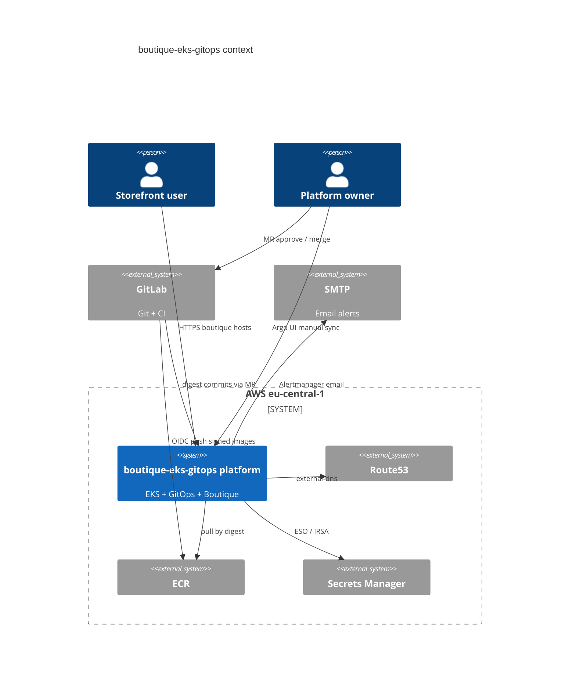

# 02 — System context

## Purpose

Describe who interacts with the system, what sits outside the trust boundary, and how environments relate.

## Actors

| Actor | Intent |
|-------|--------|
| End user | Browses Boutique storefront over HTTPS |
| Platform owner (`@btilki`) | Approves prod digest MRs; manual Argo prod sync; operates teardown |
| Developer / CI | Pushes code; pipeline produces signed digests and MRs |
| Argo CD | Pulls Git; reconciles cluster |
| Alertmanager | Emails on critical condition |

## External systems

| System | Role |
|--------|------|
| GitLab | Source of truth + CI |
| Route53 | Public DNS for biroltilki.art |
| ACM | Public TLS certificates for ALB |
| ECR | Immutable image digests |
| Secrets Manager / SSM | Runtime secrets for ESO and SMTP |
| SMTP provider | Alert delivery |
| AWS APIs | Terraform + controllers (LB, external-dns) |

## Context diagram

**Alt text:** Users hit the platform over HTTPS. Owners approve GitLab MRs and manually sync prod in Argo. GitLab pushes images to ECR and digest commits to Git. The platform uses Route53, Secrets Manager, ECR pulls, and SMTP for alerts.

> If Mermaid C4 rendering is unavailable in your viewer, use the component diagram in [03-component-design.md](03-component-design.md).

## Environment strategy

| Env | Namespace | Hostname | Argo sync | Canary | CODEOWNERS |
|-----|-----------|----------|-----------|--------|------------|
| dev | `dev` | `dev-boutique.biroltilki.art` | Automated | No (optional later) | No |
| stage | `stage` | `stage-boutique.biroltilki.art` | Automated or controlled | Yes (frontend) | No |
| prod | `prod` | `boutique.biroltilki.art` | **Manual only** | Yes (frontend) | `@btilki` |
| platform | `platform`, `argocd`, monitoring ns | `argocd.` / `grafana.boutique...` | Automated (waves) | N/A | Platform paths reviewed |

**Why one cluster:** Cost and operational simplicity for a production **pilot**. This is **not** three-account blast-radius isolation — documented limitation.

## Platform vs application boundary

- **Platform** (shared): ingress, policy, secrets operator, observability, Argo, Rollouts controller.
- **Applications** (per env): Boutique microservices + Redis; only digest/values differ across envs.
