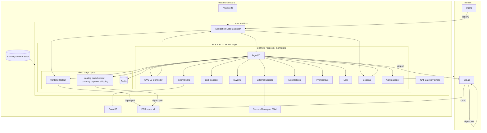

# 03 — Component design

## Purpose

Inventory major components, why each exists, and relationships.

## Component diagram

**Alt text:** Internet users and GitLab sit outside AWS. Inside the VPC, an ALB fronts EKS. Platform components (Argo, policy, ingress controllers, observability) and per-env Boutique apps run on the cluster. ECR holds images; Secrets Manager feeds ESO; Terraform state is in S3/DynamoDB; a single NAT provides egress.

## Component rationale

| Component | Why it exists | Requirement |
|-----------|---------------|-------------|
| VPC + private nodes + 1 NAT | Secure default; cost-controlled egress | FR-01, cost NFR |
| EKS 1.31 | Managed Kubernetes baseline | FR-01 |
| ECR | Immutable digests + scan-on-push | FR-01, FR-07 |
| GitLab OIDC IAM role | Keyless CI → ECR | FR-07 |
| AWS LB Controller | ALB Ingress + ACM annotations | FR-02 |
| external-dns | Automate Route53 for locked hosts | FR-02 |
| cert-manager | Platform-ready TLS tooling (not primary public path) | FR-02 |
| ACM | Public HTTPS on ALB | FR-02 |
| Argo CD | Pull-based deploy authority | FR-03 |
| ApplicationSet / app-of-apps | Multi-env + platform composition | FR-03 |
| Kyverno | Enforce digest/ECR/`latest` bans | FR-04 |
| ESO | Secrets never in Git | FR-04 |
| NetworkPolicy | Namespace isolation baseline | FR-04 |
| kube-prometheus-stack | Metrics + Grafana + AM | FR-05 |
| Loki | Logs without CloudWatch cost | FR-05 |
| Alertmanager email | Critical alerting without PagerDuty | FR-05 |
| Helm charts ×7 + Redis | Package Boutique for digest pins | FR-06 |
| GitLab CI + Trivy + cosign | Supply chain before Git mutation | FR-07 |
| CODEOWNERS / promotion docs | Prod governance | FR-08 |
| Argo Rollouts | Frontend canary stage+prod | FR-09 |
| Teardown runbook | Stop cost after pilot | FR-11 |

## Explicit non-components (out of scope)

| Not included | Why |
|--------------|-----|
| Service mesh | Complexity; GitOps depth prioritized |
| CloudWatch / PagerDuty / OTel | Cost / scope; traces deferred |
| Multi-cluster / multi-region | Pilot maturity |
| WAF | Optional later; TLS+NP first |
| Full 10+ Boutique services | Scoped to 7 + Redis |
