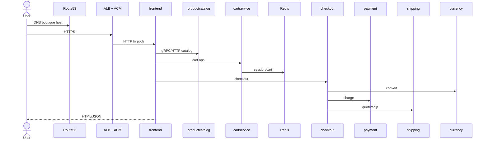
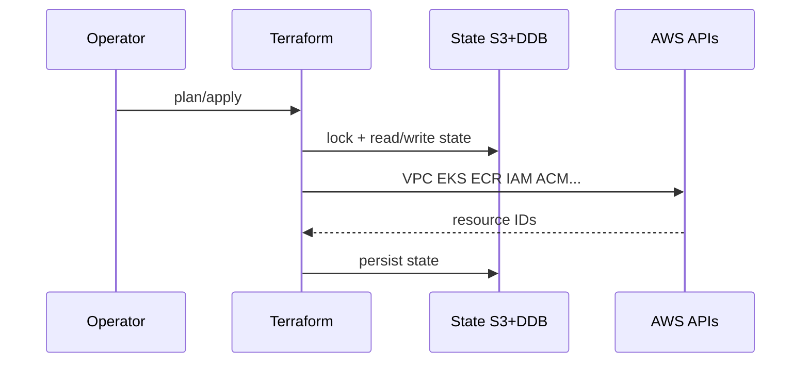
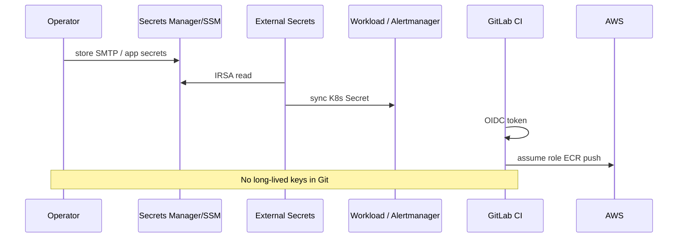
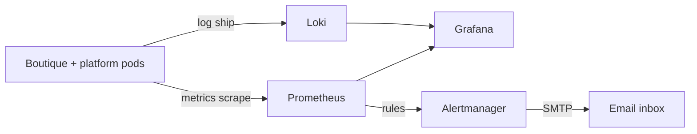

# 04 — Data flows

## Application request flow



**Alt text:** User resolves DNS, connects via ACM-backed ALB to frontend; frontend calls catalog, cart (Redis), and checkout; checkout calls currency, payment, and shipping.

## GitOps + CI flow

```mermaid
sequenceDiagram
  participant Dev as Engineer
  participant GL as GitLab CI
  participant ECR as ECR
  participant Git as Git repo
  participant Argo as Argo CD
  participant K8s as EKS

  Dev->>GL: push / MR merge to app path
  GL->>GL: test → build
  GL->>GL: Trivy CRITICAL gate
  GL->>GL: cosign sign
  GL->>ECR: OIDC push digest
  GL->>Git: open MR patch image.digest only
  Dev->>Git: merge digest MR
  Argo->>Git: poll/webhook
  Argo->>K8s: sync (auto dev/stage; manual prod)
  K8s->>ECR: pull by digest
```

**Alt text:** CI builds, scans, signs, pushes to ECR, and opens a digest-only MR. After merge, Argo syncs the cluster; pods pull immutable digests. CI never calls kubectl or argocd sync.

## Infrastructure flow



**Alt text:** Terraform applies through AWS APIs with state locked in S3/DynamoDB.

## Secrets flow



**Alt text:** Humans place secrets in AWS; ESO syncs to pods via IRSA. CI uses OIDC. Nothing secret is committed to Git.

## Telemetry flow (v1 — no OTel)



**Alt text:** Prometheus scrapes metrics; Loki stores logs; Grafana visualizes both; Alertmanager emails critical alerts. No trace pipeline in v1.
