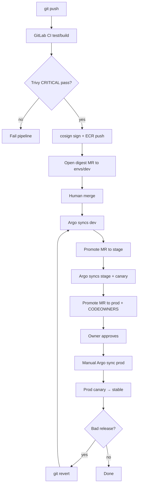

# 05 — Deployment flow

## Branching and promotion

| Path | Trigger | Result |
|------|---------|--------|
| Feature / service change | MR → `main` | May rebuild images |
| CI on successful build | Auto | Digest MR → `gitops/envs/dev/**` only |
| Promote to stage | Human MR copying digests `dev` → `stage` | Argo auto/controlled sync |
| Promote to prod | Human MR `stage` → `prod` + **`@btilki` CODEOWNERS** | Argo **manual** sync |
| Rollback | `git revert` of digest MR | Argo reconciles previous digests |

**Contract:** Promotion MRs change **only** `image.digest` (and explicitly allowed env scalars if documented). No CI `kubectl` / `argocd sync`.

## CI stages (GitLab)

```text
test → build → scan (Trivy 0.71.0) → sign (cosign 2.4.x) → sbom (CycloneDX + attest, Topic 15) → gitops (digest MR)
```

Pinned in `docs/versions.md`. Failure at CRITICAL CVE or sign error blocks the digest MR. Signing is **Sigstore keyless** (GitLab OIDC → Fulcio). Phase 7 performs a **one-time ECR digest bootstrap** so Argo can sync before the first full CI run.

## GitOps sync model

| Layer | Mechanism | Sync |
|-------|-----------|------|
| Root | App-of-apps | Automated |
| Platform | Applications / ApplicationSet | Automated + **sync waves** |
| Workloads | ApplicationSet per env | dev/stage automated; **prod manual** |

**Sync waves (conceptual):**

| Wave | Content |
|------|---------|
| 0 | CRDs / Kyverno / ESO operators |
| 1 | Policies, ClusterSecretStores, NetworkPolicies |
| 2 | Ingress stack, monitoring |
| 3 | Boutique workloads |

## Canary (frontend)

- **Stage and prod** use Argo Rollouts + ALB traffic splitting.
- Abort = Git revert of bad digest (Rollout cancels/returns to stable).
- Prod canary still requires manual Application sync to start reconciliation.

## Rollback matrix

| Layer | Mechanism |
|-------|-----------|
| Application | Git revert digest MR |
| Canary | Rollout abort / revert digest |
| Platform chart | Git revert platform values |
| Infrastructure | Terraform plan/apply prior state; avoid blind destroy in prod keep scenarios |
| Full pilot end | Phase 11 teardown |

## Deployment flowchart



**Alt text:** Pipeline builds and gates images, opens a digests MR for dev, then humans promote through stage and prod with CODEOWNERS and manual prod sync; reverts roll back via Git.

## Human gates

1. Merge digest MR to `main` (dev).
2. Merge promotion MR to stage.
3. CODEOWNERS approval for prod path.
4. Manual Argo sync for prod Application.
5. Optional: observe canary before full weight.
