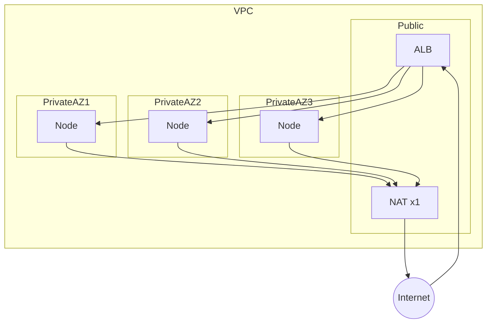

# 06 — Network design

## VPC layout

- **Region:** `eu-central-1`
- **AZs:** ≥2 (prefer 3) for node group spread
- **Public subnets:** ALB, NAT Gateway (**single NAT** for cost)
- **Private subnets:** EKS nodes, pods
- **VPC endpoints:** S3 + ECR (API/DKR) to reduce NAT data cost



**Alt text:** Internet reaches ALB in public subnets; nodes in private subnets egress via a single NAT; ALB targets nodes across AZs.

## Ingress path

```text
Internet → ALB (ACM TLS terminate) → Kubernetes Ingress → Service → Pod
```

Annotations via AWS Load Balancer Controller. Hostnames:

| Host | Target |
|------|--------|
| `dev-boutique.biroltilki.art` | frontend `dev` |
| `stage-boutique.biroltilki.art` | frontend `stage` |
| `boutique.biroltilki.art` | frontend `prod` |
| `argocd.boutique.biroltilki.art` | Argo CD server |
| `grafana.boutique.biroltilki.art` | Grafana |

## DNS flow

```text
Ingress / Service annotations → external-dns (IRSA) → Route53 record upsert
```

## East-west

- ClusterIP Services between Boutique pods.
- **NetworkPolicy:** default-deny per app namespace; allow DNS, ingress from ingress controller, allowed peer services, metrics scrape.
- **No mesh** — no sidecar mTLS in v1.

## Egress

- Image pulls: prefer **ECR VPC endpoints**; otherwise NAT.
- external-dns, LB controller, ESO → AWS APIs (endpoints/NAT).
- Alertmanager → SMTP (NAT or VPC egress path).

## Ports / protocols (summary)

| Path | Port | Protocol |
|------|------|----------|
| User → ALB | 443 | HTTPS |
| ALB → pod | 8080/etc. | HTTP (service-specific) |
| Inter-service Boutique | gRPC/HTTP | ClusterIP |
| DNS | 53 | UDP/TCP |
| Prometheus scrape | 9090/metrics | HTTP |

## Security groups (high level)

| SG | Ingress | Egress |
|----|---------|--------|
| ALB | 443 from Internet | To node SG on nodeports/pod ports as required |
| Nodes | From ALB SG; from self (pod networking) | Outbound for AWS + SMTP + needed APIs |
| Control plane | Managed by EKS | — |

## Single-NAT limitation

Loss of the NAT AZ breaks **egress** (pulls, AWS API from private pods) until recovered. Ingress via ALB in other AZs may continue. Accepted for pilot cost; multi-NAT is a future enhancement.
