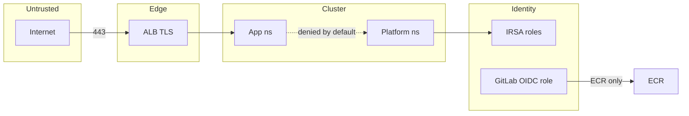

# 07 — Security architecture

## Trust zones

| Zone | Trust | Controls |
|------|-------|----------|
| Internet | Untrusted | TLS (ACM), minimal exposure (ALB 443 only) |
| Cluster edge (ALB→Ingress) | Semi-trusted | ACM, security groups; optional WAFv2 (Topic 19, `enable_waf`) |
| App namespaces | Tenant-trusted | NetworkPolicy, PSA baseline, Kyverno |
| Platform namespaces | Higher trust | Restricted RBAC; IRSA-scoped controllers |
| EKS control plane | Highly trusted | Private or public endpoint with restricted CIDRs (choose at implement); IAM auth |
| CI identity | Privileged but scoped | OIDC→IAM: ECR push + MR token only — **no** `eks:*` deploy |
| Data / secrets | Restricted | SM/SSM; ESO IRSA read; encryption at rest defaults |

**Alt text:** Internet terminates TLS at ALB before app namespaces; platform uses IRSA; GitLab OIDC can push to ECR but not deploy to the cluster API.

## Identity

| Subject | Mechanism |
|---------|-----------|
| Humans | AWS IAM / SSO for cloud; kubeconfig via IAM authenticator; Argo UI login (SSO later optional) |
| Controllers | IRSA per service account (LB controller, external-dns, ESO, etc.) |
| CI | GitLab OIDC → IAM role (ECR push); GitLab token for MR — no static AWS keys |
| Workloads | Prefer no AWS API; if needed, dedicated IRSA |

## Secrets

| Secret type | Store | Delivery |
|-------------|-------|----------|
| SMTP for Alertmanager | Secrets Manager | ESO → K8s Secret |
| App secrets (if any) | SM/SSM | ESO |
| Terraform state | S3 encryption + IAM | Remote backend |
| Cosign | Sigstore keyless (GitLab OIDC) | Fulcio/Rekor; identity-bound signatures |
| Bootstrap images | One-time ECR digest push in Phase 7 | Unblocks GitOps before first CI |
| Post-test | Immediate Phase 11 teardown | No keep-alive after validation |

**Never** commit secrets or long-lived cloud keys to Git.

## Supply chain

| Control | Tool |
|---------|------|
| Vulnerability gate | Trivy `0.71.0` CRITICAL fail |
| Image signing | cosign `2.4.x` Sigstore keyless |
| SBOM | CycloneDX via Trivy + `cosign attest` (Topic 15) |
| Registry | ECR scan-on-push |
| Admission | Kyverno: digest required, deny `:latest`, ECR allowlist |
| Admission (Phase 12) | Signature + SBOM verify **Audit** → Enforce after rebuild (ADR-0007) |
| Prod path | CODEOWNERS `@btilki` |
| Edge / runtime (optional) | WAFv2 + Falco stubs (Topic 19; off by default) |

## Blast radius

| Compromise | Can access | Mitigations |
|------------|------------|-------------|
| Single Boutique pod | Peers allowed by NP; not AWS root | NP, least SA perms |
| Argo CD | Cluster write | Harden Argo RBAC, SSO later, audit |
| GitLab CI role | ECR push; open MRs | No EKS deploy perms |
| Kyverno bypass / misconfig | Policy ineffective | Policy tests; audit mode first |
| Shared cluster | Cross-env if NP fails | Manual prod sync + CODEOWNERS still limit Git |

**Honest limit:** namespace isolation ≠ account isolation.
