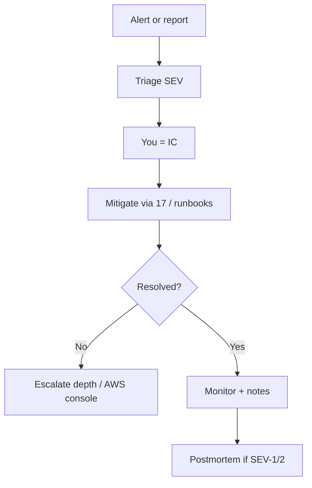

# 07 — Incident response

**Audience:** L3 — Operator  
**Applies to:** All envs  
**Prerequisites:** Access to email alerts, kubectl, GitLab, AWS console  
**Estimated time:** Triage 5–15 min; mitigation varies  
**Risk level:** Medium–High (depends on SEV)  

## Purpose

Classify and handle incidents consistently for this solo pilot (email-based, no PagerDuty).

## When to use / When not to use

**Use** on alert email, user report, or failed health check.  
**Do not use** for planned maintenance (use [12](12-maintenance.md)) or routine promotes ([02](02-deployment.md)).

## Prerequisites

- [ ] Know SEV definitions below
- [ ] Bookmark [17-common-incidents](17-common-incidents.md) and [runbooks/](../runbooks/)

## Severity

| Severity | Definition | Response time | Example |
|----------|------------|---------------|---------|
| **SEV-1** | Total outage or data/account risk | Immediate | Prod shop down; EKS API unreachable; suspected credential leak |
| **SEV-2** | Major degradation | < 30 min | Error rate high; GitOps stalled for all envs; canary serving bad digest |
| **SEV-3** | Minor impact | < 4 hours | Single non-critical pod CrashLoop in stage |
| **SEV-4** | Low / cosmetic | Next business day | Dashboard gap; docs drift |

## Procedure

### Step 1: Triage

**Commands:** Follow [08-health-checks](08-health-checks.md) (nodes, Argo, curl hosts).

```bash
date -u
kubectl get nodes
```

Assign SEV from the table. **Incident commander = You.**

**Validation:** SEV written in notes (chat/issue).

**Expected outcome:** Clear severity before changing systems.

**Recovery steps:** If unsure, treat as SEV-2 until proven lower.

**Best practices:** Prefer mitigate (rollback) over deep root-cause during SEV-1/2.

### Step 2: Mitigate

Open the matching playbook in [17](17-common-incidents.md) or symptom runbook.

Typical SEV-1/2 mitigations:

| Symptom | First mitigation |
|---------|------------------|
| Bad prod digest | [03-rollback](03-rollback.md) + manual Argo sync |
| Ingress/TLS | [runbooks/ingress](../runbooks/ingress.md) |
| Canary bad | Abort + Git revert ([canary](../runbooks/canary.md)) |
| Cluster unrecoverable | [teardown](../runbooks/teardown.md) then rebuild if needed |

**Validation:** Health checks ([08](08-health-checks.md)) green or degraded-stable.

### Step 3: Communicate

Solo pilot: note start/end UTC, SEV, actions in GitLab issue or personal log. No customer status page in scope.

### Step 4: Resolve and follow up

- SEV-1/2 → schedule [19-postmortem](19-postmortem-checklist.md) within 48h  
- Disable long silences; fix alert noise  
- If pilot goal met → **Topic 14 teardown** rather than endless keep-alive



## End-to-end validation

Incident notes include: SEV, timeline, mitigation commit/MR, validation curls.

## Rollback (section-level)

If mitigation made things worse, revert the mitigation MR / undo sync — see [03](03-rollback.md).

## Related alerts and dashboards

| Alert | Dashboard | Log query |
|-------|-----------|-----------|
| Alertmanager email | Grafana / AM UI | AM pod logs |

## Security notes

Credential-leak SEV-1: rotate keys in AWS/GitLab first; do not paste secrets into issues.

## Automation opportunities

Alert annotations with `runbook_url` pointing at this folder — see [10](10-alerting.md).
