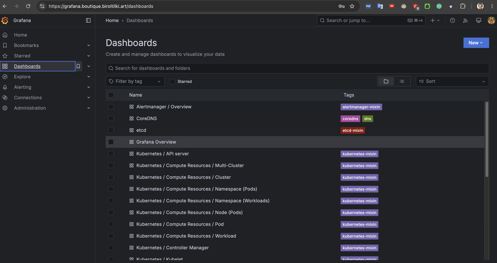

# 08 — Observability

Audience: L2 — Implementer  
Estimated time: 2–3 hours  
Prerequisites: [07 — Security baseline](07-security-baseline.md) complete (ESO Ready)  
Creates: kube-prometheus-stack (Prometheus, Grafana, Alertmanager), Loki, Grafana Ingress, SMTP via ESO, alerting runbook  
Related ADRs: [0005](../adr/0005-observability-on-cluster.md) · Runbook: [alerting.md](../runbooks/alerting.md)  
**Milestone:** **M2 — Platform complete** (with Topics 06–07)

---

## Topic goal

Operate on-cluster metrics, logs, dashboards, and **email** alerts — proving Alertmanager can reach your inbox — without CloudWatch, PagerDuty, or OTel. This topic installs Prometheus, Loki, Grafana, and Alertmanager as the observability stack.

## Why this topic is required

Production readiness needs observable failure. Milestone **M2** requires Grafana reachable and a test critical alert delivered by email.

## Before you begin

- ESO ClusterSecretStore Ready; IRSA working.
- SMTP mailbox and credentials from Topic 01 available.
- ACM ARN and DNS path from Topic 05 working.
- Cluster has spare capacity on `m6i.large` ×3 — monitoring has resource caps; watch node memory.
- Phase B Topic 08 files on `main`.

**Cost:** Extra CPU/memory on nodes; Grafana ALB shared pattern; no CloudWatch fees.

**Idempotent:** Helm/Argo re-sync safe. Disable email test rule after proof to stop alert noise.

---

## Step 8.1: Sync kube-prometheus-stack

### Goal

Install Prometheus, Alertmanager, and Grafana with resource limits via ApplicationSet wave 30.

### Why this step is required

Metrics and alert routing are the control plane for M2 validation.

### Commands

```bash
cd "$(git rev-parse --show-toplevel)"

export ACM_ARN=$(terraform -chdir=terraform/envs/prod output -raw acm_certificate_arn)

# Substitute non-secret placeholders in values (commit or keep local per policy)
FILE=gitops/platform/monitoring/values-kube-prometheus.yaml
cp "$FILE" /tmp/values-kube-prometheus.yaml
# Edit /tmp or in-place — set ACM, SMTP host/user/from/to (password NOT here)
sed -i '' "s|<ACM_CERTIFICATE_ARN>|${ACM_ARN}|g" "$FILE"
# Manually set: <SMTP_SMARTHOST> <SMTP_FROM> <SMTP_TO> <SMTP_USERNAME>
grep -E 'SMTP_|ACM_' "$FILE"

# Push to main, then:
argocd app sync kube-prometheus-stack --grpc-web
kubectl -n monitoring get pods
kubectl -n monitoring get ingress
```

Expected duration: 5–15 minutes for pods + Grafana ALB.

### GUI instructions (if applicable)

| Element | Content |
|---------|---------|
| Platform | Argo CD UI |
| Navigation | Application **kube-prometheus-stack** → SYNC if needed |
| Verification | Healthy; pods Ready in `monitoring` |

### Expected output

Prometheus, Alertmanager, Grafana pods Ready; Grafana Ingress ADDRESS present.

### Validation

```bash
kubectl -n monitoring get deploy,sts
kubectl -n monitoring get ingress -o wide
```

### Common problems

| Symptom | Likely cause | Fix |
|---------|--------------|-----|
| OOM / Pending | Node pressure | Lower memory limits temporarily or scale node group |
| Placeholders left | Incomplete sed | Grep for `<` in values file |

### Recovery

Fix values; sync app; check events in `monitoring`.

### Best practices

Keep retention at 7d for the pilot; avoid large PVCs unless needed.

### Security notes

Change Grafana admin password on first login; do not commit it.

---

## Step 8.2: Sync Loki

### Goal

Install Loki (SingleBinary, 7-day retention intent) for log exploration in Grafana.

### Why this step is required

Logs complement metrics for incident triage without CloudWatch.

### Commands

```bash
argocd app sync loki --grpc-web
kubectl -n monitoring get pods -l app.kubernetes.io/name=loki
```

### GUI instructions (if applicable)

| Element | Content |
|---------|---------|
| Platform | Argo CD UI |
| Navigation | **loki** → Healthy |
| Verification | Loki pod Ready; Grafana datasource `Loki` configured in values |

### Expected output

Loki Running in `monitoring`.

### Validation

```bash
kubectl -n monitoring get svc | grep loki
kubectl -n monitoring port-forward svc/loki 3100:3100 &
curl -fsS http://127.0.0.1:3100/ready
kill %1
```

### Common problems

| Symptom | Likely cause | Fix |
|---------|--------------|-----|
| Chart conflict | Wrong chart version | Pin `6.24.0`; check `helm show chart` |
| Datasource 404 | Service name mismatch | Confirm Grafana `additionalDataSources` URL |

### Recovery

Re-sync; adjust service URL to match `kubectl get svc`.

### Best practices

Pilot uses filesystem storage without PVC — accept log loss on restart.

### Security notes

`auth_enabled: false` is pilot-only on a private cluster network path.

---

## Step 8.3: Open Grafana UI

### Goal

Reach `https://grafana.boutique.biroltilki.art` over ACM HTTPS.

### Why this step is required

M2 requires a human-usable dashboard surface.

### Commands

```bash
dig +short grafana.boutique.biroltilki.art
curl -I --max-time 30 https://grafana.boutique.biroltilki.art

# Initial admin password (chart default or secret):
kubectl -n monitoring get secret kube-prometheus-stack-grafana \
  -o jsonpath='{.data.admin-password}' | base64 -d; echo
```

### GUI instructions (if applicable)

| Element | Content |
|---------|---------|
| Platform | Browser |
| Navigation | `https://grafana.boutique.biroltilki.art` |
| Permissions | Network to ALB |
| Verification | Login page; TLS valid; Explore shows Prometheus (+ Loki) |

| Field | Value | Why |
|-------|-------|-----|
| Username | `admin` | Chart default |
| Password | From Grafana secret | Bootstrap |
| After login | Change password | Security |

### Expected output

HTTPS UI loads; Prometheus datasource default works.



### Validation

```bash
curl -fsS -o /dev/null -w "%{http_code}\n" https://grafana.boutique.biroltilki.art
# expect 200 or 302
```

### Common problems

| Symptom | Likely cause | Fix |
|---------|--------------|-----|
| DNS missing | external-dns | Check annotation / Topic 05 |
| Login fail | Wrong secret name | `kubectl -n monitoring get secrets \| grep grafana` |

### Recovery

Fix Ingress/DNS; restart Grafana pod.

### Best practices

Bookmark Grafana; keep admin password in password manager.

### Security notes

Do not expose Grafana without TLS; consider IP allow later if pilot extends.

---

## Step 8.4: Configure SMTP via ESO

### Goal

Store SMTP password in AWS Secrets Manager; sync Secret `alertmanager-smtp` into `monitoring`; ensure Alertmanager mounts it.

### Why this step is required

Email alerts must not use passwords from Git (ADR-0005 / SECURITY.md).

### Commands

```bash
# Create secret in AWS (password only in SM)
aws secretsmanager create-secret \
  --name boutique-eks-gitops/alertmanager-smtp \
  --region eu-central-1 \
  --secret-string '{"password":"<SMTP_PASSWORD>"}'

# Ensure values file has non-secret SMTP fields set (Step 8.1)
# Sync manifests (ExternalSecret)
argocd app sync monitoring-config --grpc-web

kubectl -n monitoring get externalsecret alertmanager-smtp
kubectl -n monitoring get secret alertmanager-smtp

# Restart Alertmanager to pick up secret if already running
kubectl -n monitoring rollout restart statefulset \
  alertmanager-kube-prometheus-stack-alertmanager
```

### GUI instructions (if applicable)

| Element | Content |
|---------|---------|
| Platform | AWS Console → Secrets Manager |
| Navigation | Secret `boutique-eks-gitops/alertmanager-smtp` |
| Verification | JSON key `password` present |
| Argo | **monitoring-config** Synced |

### Expected output

Secret `alertmanager-smtp` with key `password`; Alertmanager pods Ready after restart.

### Validation

```bash
kubectl -n monitoring get secret alertmanager-smtp -o jsonpath='{.data.password}' | wc -c
# expect > 0 (do not print the value)
kubectl -n monitoring logs statefulset/alertmanager-kube-prometheus-stack-alertmanager --tail=50 \
  | grep -iE 'error|smtp|email' || true
```

### Common problems

| Symptom | Likely cause | Fix |
|---------|--------------|-----|
| ExternalSecret not Ready | IAM / wrong key name | Align SM name/property; Topic 07 IRSA |
| AM auth failures | Wrong user/pass/smarthost | Fix values + SM; restart AM |

### Recovery

Rotate password in SM; wait ESO refresh; restart Alertmanager.

### Best practices

Follow [`docs/runbooks/alerting.md`](../runbooks/alerting.md) for ongoing triage.

### Security notes

Never commit `<SMTP_PASSWORD>` or paste it into Application values.

---

## Step 8.5: Fire test alert and confirm inbox

### Goal

Receive email for `AlertmanagerEmailTest` (always-firing critical test rule).

### Why this step is required

This is the **M2 email proof**.

### Commands

```bash
# Ensure rule is synced
kubectl -n monitoring get prometheusrule boutique-alerting -o yaml | grep AlertmanagerEmailTest

# Check Prometheus sees the alert firing
kubectl -n monitoring port-forward svc/kube-prometheus-stack-prometheus 9090:9090 &
# Browser: http://127.0.0.1:9090/alerts
# Look for AlertmanagerEmailTest state=firing
```

Wait for email at `<SMTP_TO>` (often 1–5 minutes including `group_wait`).

After success, disable the test rule:

```bash
# Edit gitops/platform/monitoring/manifests/prometheusrule-boutique.yaml
# Change expr from vector(1) to vector(0) OR remove the email-test group
# Commit, push, sync monitoring-config
argocd app sync monitoring-config --grpc-web
```

### GUI instructions (if applicable)

| Element | Content |
|---------|---------|
| Platform | Mail inbox for `<SMTP_TO>` |
| Verification | Message subject contains `AlertmanagerEmailTest` or boutique-eks-gitops |
| Prometheus UI | Alerts page shows firing then inactive after disable |

### Expected output

At least one email received; test rule disabled afterward.

### Validation

Checklist:

- [ ] Email received for test alert
- [ ] Test rule disabled (`vector(0)` or removed)
- [ ] Alertmanager logs show no sustained SMTP errors

### Common problems

| Symptom | Likely cause | Fix |
|---------|--------------|-----|
| Alert firing, no email | Receiver/route/SMTP | Runbook triage table |
| Spam folder | Provider filtering | Check junk; adjust From domain |

### Recovery

Fix SMTP; re-enable `vector(1)` briefly; confirm; disable again.

### Best practices

Keep evidence (redacted screenshot/header) for Topic 13 checklist.

### Security notes

Test emails may contain cluster labels — treat as sensitive.

---

## Step 8.6: Topic validation (gate to Topic 09) — Milestone M2

### Goal

Confirm observability stack and email path for M2 sign-off.

### Why this step is required

Topic 09 deploys Boutique; platform must already be observable.

### Commands

```bash
kubectl -n monitoring get pods
curl -fsS -o /dev/null -w "%{http_code}\n" https://grafana.boutique.biroltilki.art
kubectl -n monitoring get prometheusrule
test -f docs/runbooks/alerting.md
```

### GUI instructions (if applicable)

Grafana loads; Prometheus + Loki datasources OK.

### Expected output

All checklist items pass.

### Validation

- [ ] kube-prometheus-stack Healthy (8.1)
- [ ] Loki Ready (8.2)
- [ ] Grafana HTTPS OK (8.3)
- [ ] SMTP Secret via ESO (8.4)
- [ ] Test email received; test rule disabled (8.5)
- [ ] Runbook present
- [ ] Topics 06–07 still healthy (Argo + Kyverno + ESO)

**Milestone M2:** Platform complete (Argo + security + observability with email).

### Common problems

Node pressure after stack install — scale ASG or reduce limits before Topic 09.

### Recovery

Stabilize monitoring before charts; do not add Boutique load onto OOM nodes.

### Best practices

Record M2 completion in ROADMAP when executing Phase C.

### Security notes

Confirm no SMTP password in Git history (`git log -p -- gitops/platform/monitoring | grep -i password` should only show file path references).

---

## Topic validation (end-to-end)

Topic 08 / **M2** is complete when Step 8.6 checklist passes.

**Cost check:** Monitoring uses node memory; teardown in Topic 14 removes it with the cluster.

---

## Topic troubleshooting

| Area | Symptom | Action |
|------|---------|--------|
| Grafana | CrashLoop | Raise memory limit; check PVC-less storage |
| AM | `authenticate` errors | SM password / username / smarthost |
| Loki | Grafana Explore empty | Install log agents later if needed; SingleBinary accepts pushes — optional Promtail deferred |
| Rules | Not discovered | Label `release: kube-prometheus-stack` must match chart release |

---

## Next step

**[09 — Boutique charts](09-boutique-charts.md)** (Phase B next).

Bootstrap ECR digests, then expose `dev-boutique.biroltilki.art`. Replace `BoutiqueIngressDown` expression with a real probe when the storefront is live.
