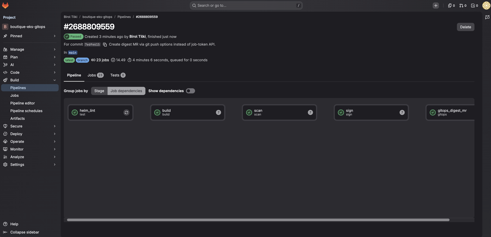

# 10 — GitLab CI digests

Audience: L2 — Implementer  
Estimated time: 2–3 hours  
Prerequisites: [09 — Boutique charts](09-boutique-charts.md) complete; Terraform GitLab OIDC role from Topic 04  
Creates: [`.gitlab-ci.yml`](../../.gitlab-ci.yml), [`docs/ci.md`](../ci.md), [`docs/adr/0006-cosign-signing-mode.md`](../adr/0006-cosign-signing-mode.md)  
Related ADRs: [0001](../adr/0001-digest-only-gitops.md) · [0006](../adr/0006-cosign-signing-mode.md) · later [0007](../adr/0007-admission-verify-and-sbom.md) (Topic 15 SBOM)

---

## Topic goal

Run a GitLab **CI (Continuous Integration)** pipeline that builds/publishes images to ECR (OIDC), fails on Trivy CRITICAL, signs with cosign Sigstore keyless, and opens a digest-only **MR (Merge Request)** for `gitops/envs/dev` — without ever deploying to the cluster.

Phase 12 extends the same pipeline with an **`sbom`** stage and test-stage security gates (Topics [15](15-supply-chain-verify-sbom.md)–[16](16-ci-security-gates.md)); stages become `test → build → scan → sign → sbom → gitops`.

## Why this topic is required

This is FR-07 / ADR-0001 in action: CI may change Git desired state (digests) but must not hold cluster deploy credentials.

## Before you begin

- Topic 04 `gitlab_ci_role_arn` output available.
- Topic 09 charts + ECR repos populated.
- GitLab Maintainer access; CI/CD variables permission.
- Phase B Topic 10 files present on the default branch.

**Idempotent:** Re-running pipelines creates new tags/`ci-<sha>` images and new MRs.

---

## Step 10.1: Configure GitLab OIDC → AWS IAM

### Goal

Ensure GitLab can assume the Terraform-created CI role via OIDC (audience/subject match).

### Why this step is required

Without a correct trust policy, build jobs cannot push to ECR.

### Commands

```bash
cd "$(git rev-parse --show-toplevel)/terraform/envs/prod"
terraform output -raw gitlab_ci_role_arn
aws iam get-role --role-name boutique-eks-gitops-gitlab-ci \
  --query 'Role.AssumeRolePolicyDocument' --output json
```

Confirm `gitlab_project_path` in `terraform.tfvars` matches GitLab `path_with_namespace` exactly. Re-apply if needed:

```bash
terraform apply -target=module.iam_gitlab_oidc
```

### GUI instructions (if applicable)

| Element | Content |
|---------|---------|
| Platform | GitLab |
| Navigation | Project → **Settings** → **CI/CD** → **JWT** / OIDC is automatic for `id_tokens` — no toggle required on gitlab.com for basic OIDC |
| Permissions | Maintainer |
| Verification | Later Step 10.2 succeeds |

| Field (Terraform / IAM) | Value | Why |
|-------------------------|-------|-----|
| Issuer | `https://gitlab.com` (or self-managed URL) | Must match module `gitlab_url` |
| Audience | `https://gitlab.com` | Matches CI `id_tokens.aud` |
| Subject like | `project_path:<group>/<project>:*` | Limits which pipelines can assume role |

**GitLab CI/CD variable:**

| Element | Content |
|---------|---------|
| Platform | GitLab |
| Navigation | **Settings** → **CI/CD** → **Variables** → **Add variable** |
| Permissions | Maintainer |

| Key | Value | Flags |
|-----|-------|-------|
| `AWS_ROLE_ARN` | `arn:aws:iam::ACCOUNT:role/boutique-eks-gitops-gitlab-ci` | Protected (optional), **not** masked if ARN length issues — Masked OK if supported |
| `AWS_DEFAULT_REGION` | `eu-central-1` | Optional (also in `.gitlab-ci.yml`) |

### Expected output

Role trust shows Federated GitLab OIDC; CI variable `AWS_ROLE_ARN` set.

### Validation

```bash
test -n "$(terraform output -raw gitlab_ci_role_arn)"
```

### Common problems

| Symptom | Likely cause | Fix |
|---------|--------------|-----|
| Subject mismatch | Wrong `gitlab_project_path` | Fix tfvars; apply |
| Self-managed GitLab | Different issuer URL | Set `gitlab_url` accordingly |

### Recovery

Update trust; do not add static access keys.

### Best practices

Keep CI role ECR-only (verify no `eks:*` in role policy).

### Security notes

Never create `AWS_ACCESS_KEY_ID` / `AWS_SECRET_ACCESS_KEY` variables for this pipeline.

---

## Step 10.2: Prove OIDC assume-role / ECR hop

### Goal

From a temporary CI job or local OIDC simulation, prove the role can authenticate to ECR.

### Why this step is required

Catch IAM mistakes before investing in full matrix builds.

### Commands

**Option A — pipeline smoke (recommended):** push Topic 10 files and run a pipeline; watch `build` job `aws sts get-caller-identity` in logs.

**Option B — local check of role policy only:**

```bash
aws iam list-role-policies --role-name boutique-eks-gitops-gitlab-ci
aws iam get-role-policy --role-name boutique-eks-gitops-gitlab-ci --policy-name ecr-push \
  --query 'PolicyDocument.Statement[].Action' --output json
```

### GUI instructions (if applicable)

| Element | Content |
|---------|---------|
| Platform | GitLab |
| Navigation | **Build** → **Pipelines** → latest → **build** job log |
| Verification | `Arn` of assumed role printed; `docker login` to ECR succeeds |

### Expected output

`get-caller-identity` shows the CI role; ECR login succeeds.

### Validation

Build job log contains successful STS + docker login (no `AccessDenied`).

### Common problems

| Symptom | Likely cause | Fix |
|---------|--------------|-----|
| `Not authorized to perform sts:AssumeRoleWithWebIdentity` | aud/sub mismatch | Fix IAM trust + `id_tokens.aud` |
| ECR login denied | Missing ecr permissions | Check role policy |

### Recovery

Fix IAM; re-run pipeline. Do not fall back to access keys.

### Best practices

Keep first successful STS output in session notes (redact account if required).

### Security notes

Job logs may contain account IDs — treat as sensitive in public projects.

---

## Step 10.3: Confirm pipeline files and CI settings

### Goal

Verify `.gitlab-ci.yml`, `docs/ci.md`, and ADR-0006 are on the default branch; runners can use Docker-in-Docker.

### Why this step is required

Missing files or DinD-incapable runners block build/scan/sign.

### Commands

```bash
cd "$(git rev-parse --show-toplevel)"
test -f .gitlab-ci.yml
test -f docs/ci.md
test -f docs/adr/0006-cosign-signing-mode.md
grep -nE 'kubectl|argocd sync' .gitlab-ci.yml && exit 1 || echo "no cluster deploy commands: OK"
grep -n 'gitops/envs/dev' .gitlab-ci.yml
```

### GUI instructions (if applicable)

| Element | Content |
|---------|---------|
| Platform | GitLab |
| Navigation | **Settings** → **CI/CD** → **Runners** — ensure shared/instance runners with Docker available |
| Also | **Settings** → **CI/CD** → **Token Access** / job token permissions — allow pushing to this project + creating MRs |
| Verification | Pipeline appears on commit to default branch |

Enable **CI_JOB_TOKEN** push + MR API as required by your GitLab version (Project → Settings → CI/CD → Job token permissions / Limit access).

### Expected output

Files present; no kubectl/argocd deploy usage; runners ready.

### Validation

```bash
grep -E 'TRIVY_VERSION: \"0.71.0\"|COSIGN_VERSION: \"2.4' .gitlab-ci.yml
```

### Common problems

| Symptom | Likely cause | Fix |
|---------|--------------|-----|
| Job token cannot push | Permissions | Allow project job token write to repo + MR create |
| No DinD | Runner config | Use SaaS runners or enable privileged DinD |

### Recovery

Fix runner/token settings before Step 10.4.

### Best practices

Protect `main` so only reviewed MRs merge digest changes.

### Security notes

Review `.gitlab-ci.yml` in MR like production code.

---

## Step 10.4: Run pipeline — Trivy CRITICAL gate

### Goal

Execute pipeline through **scan**; CRITICAL findings must fail the job.

### Why this step is required

Supply-chain gate before signing and GitOps MR.

### Commands

```bash
# Trigger: git push to default branch after merging Topic 10 files
# Observe in GitLab UI
```

Optional local Trivy against an ECR image (after build):

```bash
trivy image --severity CRITICAL --exit-code 1 --ignore-unfixed "${IMAGE}"
```

### GUI instructions (if applicable)

| Element | Content |
|---------|---------|
| Platform | GitLab → **Build** → **Pipelines** |
| Navigation | Open pipeline → ensure **scan** jobs for each SERVICE |
| Verification | All scan jobs green, or fail with CRITICAL listed |

### Expected output

Scan jobs pass (or fail correctly on CRITICAL — fix upstream/base before continuing).

### Validation

All `scan` matrix jobs succeeded for the seven services.

### Common problems

| Symptom | Likely cause | Fix |
|---------|--------------|-----|
| CRITICAL fail | Vulnerable upstream | Newer Boutique tag / rebuild strategy; do not `--exit-code 0` |
| Trivy download fail | Network | Retry; mirror binary if needed |

### Recovery

Address CVEs or pin a fixed upstream; re-run pipeline.

### Best practices

Keep Trivy at **0.71.0** per `docs/versions.md`.

### Security notes

Never disable the CRITICAL gate permanently to “get green.”

---

## Step 10.5: Cosign Sigstore keyless sign

### Goal

Confirm **sign** jobs succeed using `SIGSTORE_ID_TOKEN` (no cosign key variables).

### Why this step is required

ADR-0006 keyless signing is the locked supply-chain control.

### Commands

```bash
# From pipeline logs: cosign sign --yes $IMAGE succeeds
```

### GUI instructions (if applicable)

| Element | Content |
|---------|---------|
| Platform | GitLab pipeline → **sign** jobs |
| Verification | Job green; no `COSIGN_PRIVATE_KEY` variable used |

### Expected output

Each service image signed in the registry/Rekor flow without local keys.

### Validation

Optional verify (from workstation with cosign 2.4.x):

```bash
# See docs/ci.md verify example — adjust identity regexp to your project
```

### Common problems

| Symptom | Likely cause | Fix |
|---------|--------------|-----|
| Fulcio/OIDC error | Missing `SIGSTORE_ID_TOKEN` | Ensure `id_tokens` block on sign job |
| Network blocked | Egress to Sigstore | Allow required endpoints |

### Recovery

Fix OIDC token; re-run sign. Do not switch to static keys without a new ADR.

### Best practices

Keep cosign **2.4.x** pinned in CI variables section.

### Security notes

Keyless signatures are tied to GitLab identity — protect who can run pipelines on `main`.

---

## Step 10.6: Digest-only MR for `gitops/envs/dev`

### Goal

**gitops** job opens an MR updating only `image.digest` under `gitops/envs/dev/values/*.yaml`.

### Why this step is required

This is the sole CI→cluster path: merge MR → Argo reconciles.

### Commands

```bash
# After pipeline: note MR URL from gitops_digest_mr job log
```

### GUI instructions (if applicable)

| Element | Content |
|---------|---------|
| Platform | GitLab → **Merge requests** |
| Navigation | Open `ci: digest updates for dev (…)` |
| Verification | Diff touches **only** `gitops/envs/dev/values/*.yaml` digest lines |
| Action | Review → merge |

### Expected output

MR with digest-only changes; no Terraform/Helm chart/prod path edits.

### Validation

```bash
# Locally after checking out the MR branch:
git diff origin/main... --name-only
# expect only gitops/envs/dev/values/*.yaml
```

### Common problems

| Symptom | Likely cause | Fix |
|---------|--------------|-----|
| Push denied | Job token permissions | Step 10.3 token access |
| MR empty | Digests unchanged | New commit SHA / force rebuild |
| Extra files | Script bug | Fail closed — fix CI before merge |

### Recovery

Close bad MR; fix CI; re-run.

### Best practices

Merge digest MR; confirm Argo syncs `*-dev` apps.

### Security notes

CI must never write `gitops/envs/prod/**`.

---

## Step 10.7: Confirm no cluster deploy from CI

### Goal

Prove pipeline definition and jobs do not deploy to Kubernetes/Argo.

### Why this step is required

Hard rule / ADR-0001 enforcement.

### Commands

```bash
cd "$(git rev-parse --show-toplevel)"
grep -nE 'kubectl|argocd|helm upgrade --install|aws eks update-kubeconfig' .gitlab-ci.yml \
  && echo "FOUND FORBIDDEN" && exit 1 \
  || echo "CI deploy tools: absent OK"
```

### GUI instructions (if applicable)

Review all job scripts in the successful pipeline — no cluster API calls.

### Expected output

No matches for forbidden deploy tools in `.gitlab-ci.yml`.

### Validation

Checklist item signed off in session notes.

### Common problems

| Symptom | Likely cause | Fix |
|---------|--------------|-----|
| Someone adds kubectl “temporarily” | Process drift | Reject MR; restore contract |

### Recovery

Revert CI changes immediately.

### Best practices

Add CI contract link in MR templates.

### Security notes

Cluster credentials must not appear as CI variables.

---

## Step 10.8: Topic validation (gate to Topic 11)

### Goal

Confirm digest CI path end-to-end.

### Why this step is required

Topic 11 promotion assumes digests arrive in `dev` via MR.

### Commands

```bash
test -f .gitlab-ci.yml && test -f docs/ci.md && test -f docs/adr/0006-cosign-signing-mode.md
```

### GUI instructions (if applicable)

Pipeline green on `main`; digest MR merged; Argo `frontend-dev` (etc.) Healthy on new digests.

### Expected output

All checklist items pass.



### Validation

- [ ] OIDC role + `AWS_ROLE_ARN` configured (10.1)
- [ ] STS/ECR hop works (10.2)
- [ ] Pipeline files + runner/token OK (10.3)
- [ ] Trivy CRITICAL gate active (10.4)
- [ ] Cosign keyless sign works (10.5)
- [ ] Digest-only MR to `envs/dev` merged (10.6)
- [ ] No kubectl/argocd deploy in CI (10.7)

### Common problems

Argo not picking digests — check Application sync and Kyverno.

### Recovery

Fix GitOps values; re-sync apps; do not kubectl set image.

### Best practices

Keep one successful pipeline URL as evidence for Topic 13.

### Security notes

Confirm CI role still lacks EKS deploy permissions after any IAM changes.

---

## Topic validation (end-to-end)

Topic 10 is complete when Step 10.8 checklist passes.

**Cost check:** ECR storage grows with `ci-<sha>` tags — lifecycle policy retains last 20 (Topic 04).

---

## Topic troubleshooting

| Area | Symptom | Action |
|------|---------|--------|
| Matrix artifacts | Missing `digest-*.env` in gitops job | Ensure `needs: sbom` (Topic 15) and artifacts paths |
| yq | Not found | alpine job installs yq via apk |
| Immutable tag | `ci-SHA` collision | SHA unique per commit |
| Cosign | Rekor failures | Retry; check time sync |

---

## Next step

**[11 — Promotion](11-promotion.md)** (Phase B next).

Human MRs copy digests `dev → stage → prod` with CODEOWNERS on prod.
